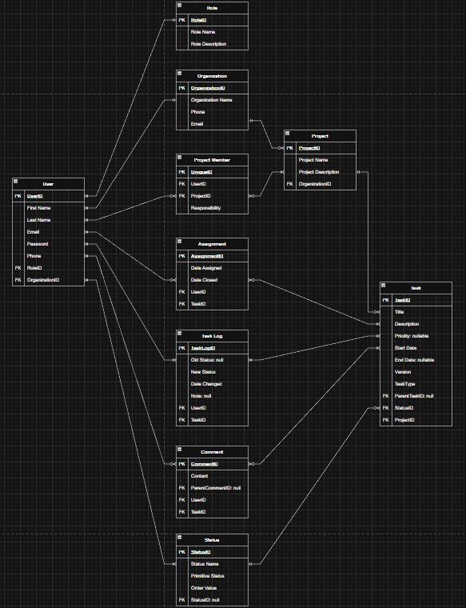

# LaunchPad
A project management app currently in early development.

## Febuary 2nd (Log 2)
Mapped out feature goals for this application & updated database schema to match:

### Features (May add more minor features at a later date)
1. Project Structure:
    - Users can create multiple projects, each with its own set of tickets.
    - User Roles - Users will have roles (eg. Software Dev, Project Manager, etc.) that enable or disable certain permissions.
    - Project Settings - A page to change the project name, description, etc.
2. Dynamic Workflows:
    - Custom Status Creation - A settings page where users can add, rename, or reorder columns.
    - Category Mapping - Every custom status must map to a meta-status (To-Do, In-Progress or Done) to keep reporting and records consistent.
3. Ticket Management:
    - Rich Text Descriptions - Markdown editor (react-markdown) so developers can paste codeblocks.
    - Ticket Priority - Visual indicators for Urgent, High, Medium, and Low.
    - Ticket Assignment - Drop down to assign a ticket to a specifc user.
    - Ticket Discussions - A threaded comment section at the bottom of each ticket for team discussion.
4. Solid UI/UX Design:
    - Drag and Drop Kanban - Smooth movement of cards between columns and the database updates in the background (Optimistic UI Design).
    - Global Search - Command pallete with a keybind shortcut to quickly search for tickets by multiple filters.
    - Real-Time Updates - Users will see eachothers changes in real time (WebSocket).
5. Other Notable Features:
    - Responsive Design - Kanban board is usable on every device.
    - Authorization - User and role based authorization. OAuth? Clerk?
    - Defensive Programming & Error Handling - Users should not be able to make the application crash. Errors should be handled well and with meaningful messages.
    - Loading States - Feedback to the user to let them know when data is being fetched.
    - Documentation - Logs will be made for every day worked on this application. When finished there will be indepth documentation on how each piece works.

### New Database Schema
#### Database schema based on all features (Subject to change):
