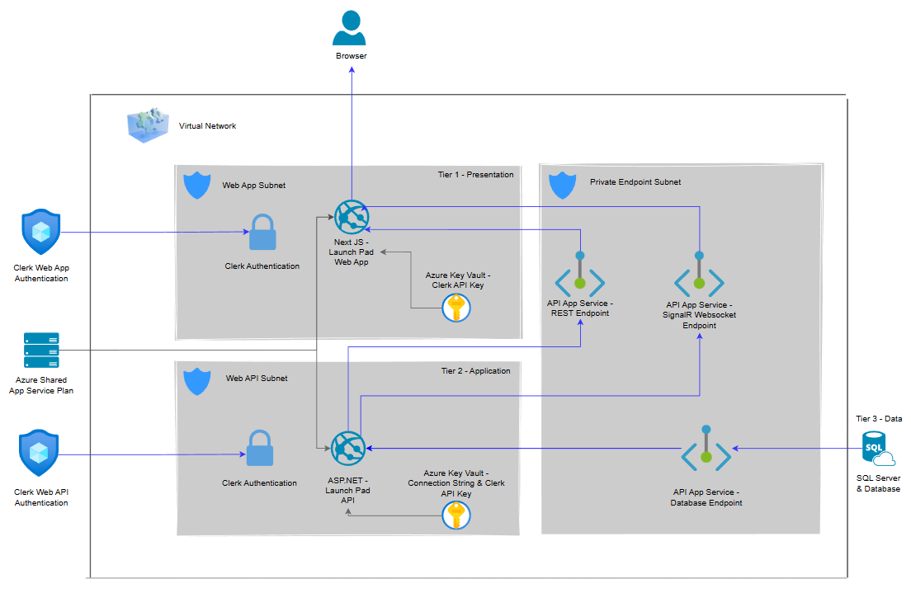
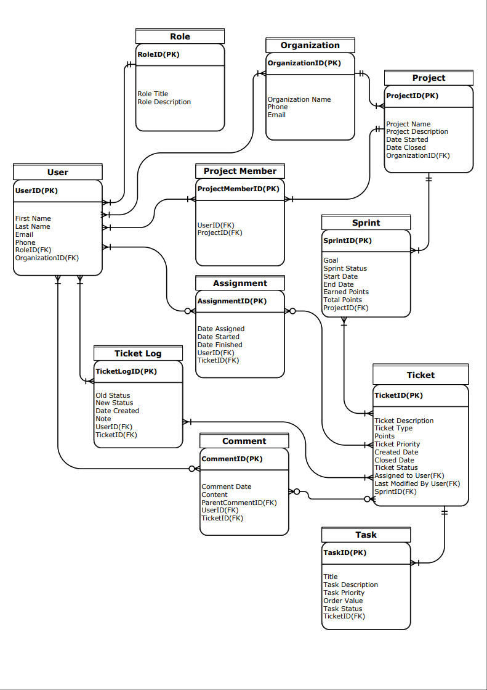

# LaunchPad

A modern project management application tailored to software development teams using Agile and Scrum methodologies.

## Table of Contents

- [LaunchPad](#launchpad)
  - [Table of Contents](#table-of-contents)
    - [Quick Overview](#quick-overview)
    - [Recent Additions](#recent-additions)
      - [LaunchPad — Three-Tier Application Architecture (Azure)](#launchpad--three-tier-application-architecture-azure)
      - [Updated ERD](#updated-erd)
        - [Key Considerations](#key-considerations)
      - [Authorization \& Authentication](#authorization--authentication)
        - [Authentication](#authentication)
        - [Real-Time Connection](#real-time-connection)
        - [Role-Based Access Control](#role-based-access-control)
        - [Back-End Authentication](#back-end-authentication)

---

### Quick Overview

LaunchPad is a project management application currently in development, designed for software development teams utilizing Agile and Scrum methodologies. Users can:

- Create and manage sprints through a Scrum board with draggable tickets.
- Create and update tickets along with tasks on each ticket.
- Manage ticket status directly on the Scrum board.
- Add rich text comments and replies to tickets.
- View the ticket backlog to plan and create new sprints.

A demo of this application will be deployed to Azure after development concludes. Azure was chosen because both the front-end and back-end frameworks (Next.js and ASP.NET + SQL Server) are well supported on the platform. Additionally, Azure provides access to Azure Key Vault, which will be used for securely storing API keys.

### Recent Additions

#### LaunchPad — Three-Tier Application Architecture (Azure)

The diagram below illustrates the three-tier application architecture used to structure and deploy LaunchPad on Azure.

- **Tier 1 — Presentation**: The Next.js front end is hosted in its own Web App Subnet. Clerk handles user authentication at this layer, and secrets such as the Clerk API key are pulled from Azure Key Vault.
- **Tier 2 — Application**: The ASP.NET Core Web API lives in a separate Web API Subnet. It handles business logic, exposes both REST and SignalR WebSocket endpoints, and validates JWTs issued by Clerk. Azure Key Vault provides the database connection string and Clerk API key.
- **Tier 3 — Data**: SQL Server hosts the application database and is accessed by the API through a private endpoint, ensuring traffic stays within the Azure Virtual Network.

Communication between tiers flows through a Private Endpoint Subnet, keeping all inter-service traffic internal to the Virtual Network. Clerk operates as an external authentication provider, accessed by both the front end and back end for token issuance and validation.



#### Updated ERD

##### Key Considerations

- Self-referencing comments table
  - The Comment table is self-referencing, as comments can have nested replies. This allows team members to reply directly to each other's comments on a ticket.
- The Role table may be simplified to an enum since only three roles currently exist (Developer, QA, Scrum Leader).
- Additional features that could introduce new tables may be added after initial deployment.



#### Authorization & Authentication

This application uses [Clerk](https://clerk.com/) to handle both authentication and authorization.

##### Authentication

- The Clerk API is used to check whether a user is logged in. If they are not, they cannot access protected pages and will be redirected to a sign-in page.

```ts
import { clerkMiddleware, createRouteMatcher } from '@clerk/nextjs/server';

const isPublicRoute = createRouteMatcher(["/sign-in(.*)", "/sign-up(.*)"])

export default clerkMiddleware(async (auth, req) => {

  if(!isPublicRoute(req)) await auth.protect();
});

export const config = {
  matcher: [
    // Skip Next.js internals and all static files, unless found in search params
    '/((?!_next|[^?]*\\.(?:html?|css|js(?!on)|jpe?g|webp|png|gif|svg|ttf|woff2?|ico|csv|docx?|xlsx?|zip|webmanifest)).*)',
    // Always run for API routes
    '/(api|trpc)(.*)',
  ],
};
```

- A context provider is then created that ensures the user is signed in, then pulls a `UserId` from the metadata supplied by Clerk. This ID is used to make a GET request to the back end, retrieving the user's data from the database.

```tsx
useEffect(() => {
    if (!isSignedIn || !user?.publicMetadata?.id) {
        return;
    }
    const fetchUser = async () => {
        try{
            const data = await fetchApi<UserData>(`user/${user.metadata.id}`, "GET");
            setUser(data);
        }
        catch (err){
            console.error("Failed to fetch user:", err);
        }
        finally{
            setLoading(false);
        }
    }
    fetchUser();
    }, [isSignedIn, user]);

return(
    <UserContext.Provider value={{ userDb, loading }}>
        {children}
    </UserContext.Provider>
)
```

##### Real-Time Connection

- Each request to the back end is authenticated. A custom hook is created using Microsoft's SignalR package to establish a WebSocket connection with the back end. To authorize the request, the JWT provided by Clerk is pulled and passed along for validation. If the user is authorized, the connection is established and they will receive live data updates based on the page they are on.

```ts
export const useSocket = () => {
    const { getToken } = useAuth();
    const connectionRef = useRef<HubConnection | null>(null);
    const [connected, setConnected] = useState(false);

    useEffect(() => {
        const connection = new HubConnectionBuilder()
            .withUrl(`${process.env.API_URL}/data`, {
                accessTokenFactory: async () => {
                    const token = await getToken();
                    return token ?? "";
                }
            })
            .withAutomaticReconnect()
            .configureLogging(LogLevel.Information)
            .build();

            connectionRef.current = connection;

            // --Middleware and error handling--

            connection.start()
                .then(() => {
                    console.log("Connected to socket");
                    setConnected(true);
                })
                .catch(err => console.error("Failed to connect to socket", err));

            return () => {
                if (connection.state !== HubConnectionState.Disconnected) {
                    connection.stop();
                }
            }
    }, [getToken])

    return { connection: connectionRef.current, connected };
};
```

##### Role-Based Access Control

- On the front end, a `RoleGate` component checks with the back end that a user has the proper role to view certain pages and tools. **This is only for the UI** — the user's role is always verified on the back end before any CRUD operation is carried out.

```tsx
export function RoleGate({ allowed, fallback = null, children }: RoleGateProps) {
    const { userDb, loading } = useDbUser();

    if (loading) return <>{fallback}</>;

    const roles = Array.isArray(allowed) ? allowed : [allowed];

    if (!userDb?.role || !roles.includes(userDb?.role)) return <></>;

    return <>{children}</>
}
```

##### Back-End Authentication

- All requests are authenticated on the back end. JWT Bearer authentication is configured to validate tokens issued by Clerk. For WebSocket connections, the token is extracted from the query string since WebSockets cannot use standard authorization headers.

```csharp
        builder.Services.AddAuthentication(JwtBearerDefaults.AuthenticationScheme).AddJwtBearer(options =>
        {
            options.Authority = builder.Configuration["Clerk:Authority"];
            options.TokenValidationParameters = new TokenValidationParameters
            {
                ValidateAudience = false,
                ValidateIssuer = true,
                ValidIssuer = builder.Configuration["Clerk:Authority"],
                NameClaimType = "sub"
            };
            options.Events = new JwtBearerEvents
            {
                OnMessageReceived = context =>
                {
                    var accessToken = context.Request.Query["access_token"];
                    var path = context.HttpContext.Request.Path;
                    if (!string.IsNullOrEmpty(accessToken) && path.StartsWithSegments("/data"))
                    {
                        context.Token = accessToken;
                    }
                    return Task.CompletedTask;
                },
                OnAuthenticationFailed = context =>
                {
                    Console.WriteLine($"Auth failed: {context.Exception.Message}");
                    return Task.CompletedTask;
                },
                OnChallenge = context =>
                {
                    Console.WriteLine($"Challenge error: {context.Error}");
                    Console.WriteLine($"Challenge description: {context.ErrorDescription}");
                    return Task.CompletedTask;
                }
            };
        });
        builder.Services.AddAuthorization();
```

- The SignalR hub is decorated with the `[Authorize]` attribute, ensuring that only authenticated users can invoke hub methods or receive real-time updates.

```csharp
    [Authorize]
    public class DataHub : Hub
    {
        private readonly IDashboardService _dashboardService;

        public DataHub(IDashboardService dashboardService)
        {
            _dashboardService = dashboardService;
        }

        public async Task SendDashBoardData(int userId)
        {
            try
            {
                var dashboard = await _dashboardService.Get_Dash_View(userId);

                await Clients.Caller.SendAsync("DashBoardData", dashboard);
            }
            catch (Exception ex)
            {
                await Clients.Caller.SendAsync("DashBoardData", $"Data fetch error: {ex.Message}");
            }
        }
    }
```
